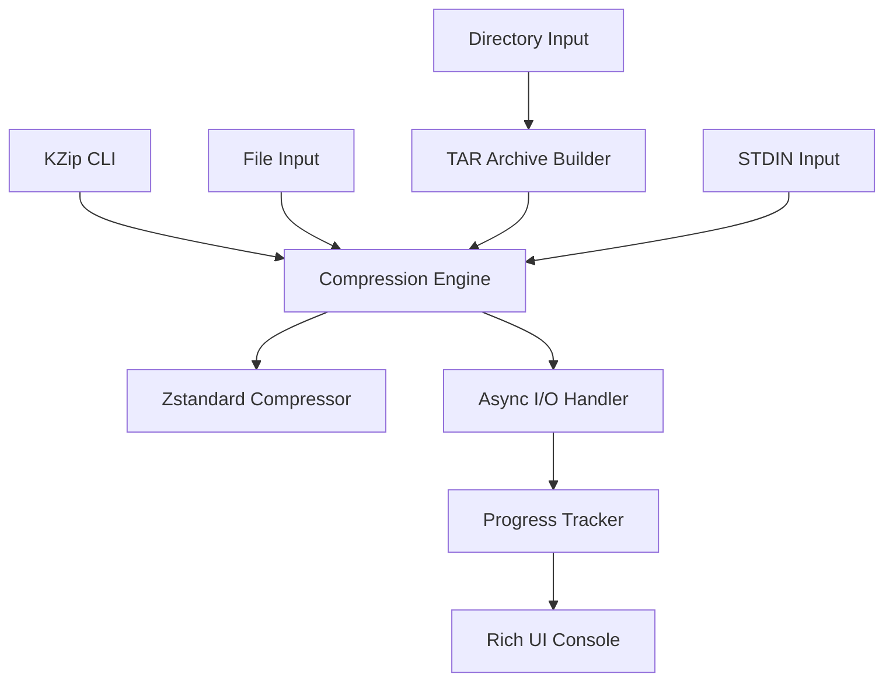

<div align="center">

# 🚀 KZip - High-Performance File Compression Tool

*Lightning-fast compression with the power of Zstandard*

[](https://python.org)
[](https://facebook.github.io/zstd/)
[](https://docs.python.org/3/library/asyncio.html)
[](https://github.com)

---

*Transform your files with blazing-fast compression ratios up to 15:1*

</div>

## ✨ What is KZip?

**KZip** is a next-generation command-line compression tool that combines the cutting-edge **Zstandard** algorithm with **asynchronous I/O** to deliver unparalleled performance. Whether you're archiving terabytes of data or compressing a single document, KZip adapts to your needs with intelligent compression modes and professional-grade features.

### 🎯 Why Choose KZip?

| Feature | Benefit |
|---------|---------|
| 🔥 **Multi-Mode Compression** | Choose between speed, balance, or maximum compression |
| 📁 **Smart Directory Handling** | Seamlessly compress entire folder structures |
| ⚡ **Async I/O Engine** | Up to 200 MB/s processing speeds |
| 🎨 **Beautiful Progress Tracking** | Real-time visual feedback with ETA |
| 🔄 **STDIN/STDOUT Support** | Perfect for pipeline integration |
| 🛡️ **Graceful Interruption** | Safe Ctrl+C handling with cleanup |

---

## 🌟 Key Features

<div align="center">

### 🎛️ Compression Modes

| Mode | Speed | Ratio | Use Case |
|------|-------|-------|----------|
| `-ms` | ⚡⚡⚡ | 5:1 | Real-time processing |
| **Default** | ⚡⚡ | 8:1 | General purpose |
| `-mc` | ⚡ | 15:1 | Long-term archival |

</div>

### 🚀 Performance Highlights

- **Compression Speed**: 50-200 MB/s
- **Decompression Speed**: 2-3x faster than compression
- **Memory Efficient**: 512MB maximum usage
- **Multi-threaded**: Auto-detects optimal thread count

### 📊 Typical Compression Ratios

```
📝 Text Files      ████████████████ 15:1
🖼️ Images (JPEG)   ██ 2:1
📄 Documents (PDF) ████████ 8:1
💻 Source Code     ████████████ 12:1
```

---

## 🔧 Installation

### 🎯 Quick Start

```bash
# 1. Download KZip
git clone https://github.com/Karthikdude/kzip.git

# 2. Install dependencies
pip install zstandard aiofiles rich

# 3. Make executable (Unix systems)
chmod +x kzip.py
```

### 🌍 Platform-Specific Installation

<details>
<summary><strong>🐧 Linux (Ubuntu/Debian)</strong></summary>

```bash
# Install Python 3.11+
sudo apt update && sudo apt install python3.11 python3-pip

# Install dependencies
pip3 install zstandard aiofiles rich

# Global installation
sudo cp kzip.py /usr/local/bin/kzip
sudo chmod +x /usr/local/bin/kzip
```
</details>

<details>
<summary><strong>🍎 macOS</strong></summary>

```bash
# Install Python (using Homebrew)
brew install python@3.11

# Install dependencies
pip3 install zstandard aiofiles rich

# Global installation
sudo cp kzip.py /usr/local/bin/kzip
sudo chmod +x /usr/local/bin/kzip
```
</details>

<details>
<summary><strong>🪟 Windows</strong></summary>

```powershell
# Install Python from python.org
# Then install dependencies
pip install zstandard aiofiles rich

# Create batch file for global access
echo @python "C:\path\to\kzip.py" %* > C:\Windows\System32\kzip.bat
```
</details>

<details>
<summary><strong>🏗️ Arch Linux</strong></summary>

```bash
# Install Python and pip
sudo pacman -S python python-pip

# Install dependencies
pip install zstandard aiofiles rich

# Global installation
sudo cp kzip.py /usr/local/bin/kzip
sudo chmod +x /usr/local/bin/kzip
```
</details>

---

## 🎮 Usage Guide

### 🎯 Basic Syntax

```bash
kzip [options] [file_or_directory]
```

### 🛠️ Command Options

| Option | Description | Example |
|--------|-------------|---------|
| `-mc, --max-compression` | Maximum compression ratio | `kzip -mc archive.tar` |
| `-ms, --max-speed` | Maximum processing speed | `kzip -ms documents/` |
| `-d, --decompress` | Decompress .zst files | `kzip -d file.zst` |
| `-r, --remove` | Auto-remove after decompression | `kzip -d -r backup.zst` |
| `-v, --verbose` | Detailed progress output | `kzip -v -mc photos/` |

---

## 💡 Examples

### 📦 Compression Examples

<table>
<tr>
<th>Use Case</th>
<th>Command</th>
<th>Output</th>
</tr>
<tr>
<td><strong>Single File</strong></td>
<td><code>kzip document.pdf</code></td>
<td><code>document.pdf.zst</code></td>
</tr>
<tr>
<td><strong>Maximum Compression</strong></td>
<td><code>kzip -mc photos/</code></td>
<td><code>photos.zst</code></td>
</tr>
<tr>
<td><strong>Speed Mode + Progress</strong></td>
<td><code>kzip -ms -v backup.tar</code></td>
<td><code>backup.tar.zst</code> with progress</td>
</tr>
<tr>
<td><strong>STDIN Pipeline</strong></td>
<td><code>cat data.txt | kzip -mc</code></td>
<td><code>stdin_output_YYYYMMDD_HHMMSS.zst</code></td>
</tr>
</table>

### 📂 Decompression Examples

<table>
<tr>
<th>Scenario</th>
<th>Command</th>
<th>Result</th>
</tr>
<tr>
<td><strong>Basic Decompression</strong></td>
<td><code>kzip -d archive.zst</code></td>
<td>Restores original with cleanup prompt</td>
</tr>
<tr>
<td><strong>Auto-cleanup</strong></td>
<td><code>kzip -d -r backup.zst</code></td>
<td>Restores and removes .zst file</td>
</tr>
<tr>
<td><strong>Verbose Decompression</strong></td>
<td><code>kzip -d -v -r project.zst</code></td>
<td>Detailed progress + auto-cleanup</td>
</tr>
</table>

---

## 🎨 Output Examples

### 🎬 Compression in Action

```
KZip v1.0.0 - High-Performance Compression Tool
========================================

Operation: Compression
Input: /home/user/documents
Output: documents.zst
Compression Level: 22 (maximum compression)
Worker Threads: 8
Max Memory: 512MB

Files processed: 1,247/1,247 | Speed: 45.2 MB/s
Progress: ████████████████████████████████ 100%

Compression Summary:
- Original size: 2,847.3 MB
- Compressed size: 284.1 MB
- Compression ratio: 10.0:1
- Total time: 1m 23s
- Average speed: 34.4 MB/s
- Files processed: 1,247
- Errors: 0
```

### 📊 Professional Progress Tracking

```
Compressing: ████████████████████ 87% | 2.1 GB/2.4 GB | 67.3 MB/s | ETA: 0:00:04
```

---

## 🏗️ Technical Architecture

### 🔧 Core Components



### 📋 System Requirements

| Component | Requirement |
|-----------|-------------|
| **Python** | 3.11+ |
| **Memory** | 512MB available RAM |
| **Storage** | Temp space = largest file size |
| **CPU** | Multi-core recommended |

### 🔗 Dependencies

| Package | Purpose | Version |
|---------|---------|---------|
| `zstandard` | High-performance compression | >=0.23.0 |
| `aiofiles` | Asynchronous file operations | >=24.1.0 |
| `rich` | Beautiful terminal UI | >=14.1.0 |

---

## 🎛️ Configuration

### ⚙️ Compression Levels

| Level | Speed | Ratio | Memory | Use Case |
|-------|-------|-------|--------|----------|
| **1** | Fastest | Good | Low | Real-time |
| **9** | Balanced | Better | Medium | General |
| **22** | Slowest | Best | High | Archival |

### 📊 Performance Tuning

```python
# Internal Configuration
CHUNK_SIZE = 65536      # 64KB chunks
MAX_MEMORY_MB = 512     # Memory limit
MAX_WORKERS = 8         # Thread limit
```

---

## 🔍 Troubleshooting

### ⚠️ Common Issues

<details>
<summary><strong>❌ "Required dependency missing"</strong></summary>

**Solution:**
```bash
pip install zstandard aiofiles rich
```
</details>

<details>
<summary><strong>🔒 Permission denied (Linux/macOS)</strong></summary>

**Solution:**
```bash
sudo cp kzip.py /usr/local/bin/kzip
sudo chmod +x /usr/local/bin/kzip
```
</details>

<details>
<summary><strong>🐍 Python not found</strong></summary>

**Solutions:**
- Ensure Python 3.11+ is installed
- Use `python3` instead of `python`
- Add Python to your system PATH
</details>

<details>
<summary><strong>💾 Out of memory errors</strong></summary>

**Solutions:**
- Use `--max-speed` mode: `kzip -ms large_file.tar`
- Ensure sufficient disk space
- Close other memory-intensive applications
</details>

### 🛠️ Debugging Commands

```bash
# Verify installation
python -c "import zstandard, aiofiles, rich; print('✅ All dependencies OK')"

# Test basic functionality
kzip --help

# Verbose mode for detailed output
kzip -v file.txt
```

---

## 🤝 Contributing

KZip welcomes contributions! Here's how to get started:

### 🎯 Development Guidelines

1. **🐍 Python 3.11+ Compatibility**: Ensure code works across versions
2. **🎨 Code Style**: Follow existing patterns and PEP 8
3. **🧪 Testing**: Test with various file types and sizes
4. **🌍 Cross-platform**: Maintain Windows, macOS, and Linux support

### 🚀 Quick Contribution Setup

```bash
# Fork and clone the repository
git clone https://github.com/Karthikdude/kzip.git
cd kzip

# Install development dependencies
pip install zstandard aiofiles rich

# Make your changes
# Test thoroughly
python kzip.py --help

# Submit a pull request
```

---

## 📄 License

This project is **open source**. Please review license terms before commercial use.

---

## 📈 Version History

| Version | Release Date | Highlights |
|---------|-------------|------------|
| **v1.0.0** | 2024 | 🎉 Initial release with full feature set |
| | | ✨ Zstandard compression with multiple modes |
| | | ⚡ Asynchronous I/O for high performance |
| | | 🎨 Professional terminal UI with progress tracking |
| | | 🌍 Cross-platform compatibility |

---

<div align="center">

## 🌟 Star this project if you find it useful!

### 📧 Questions? Issues? Contributions?

[🐛 Report Bug](https://github.com/Karthikdude/kzip/issues) | [✨ Request Feature](https://github.com/Karthikdude/kzip/issues) | [📖 Documentation](https://github.com/Karthikdude/kzip/wiki)

---

**Made with ❤️ by Karthik S Sathyan**

*Compress smarter, not harder*

</div>
